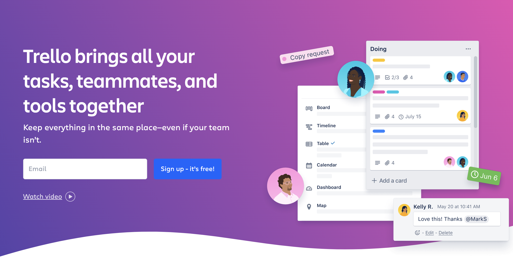

<div align="left">

[](https://developer.atlassian.com&#x2F;cloud&#x2F;trello)

# [Trello](https://developer.atlassian.com&#x2F;cloud&#x2F;trello)

This document describes the REST API of Trello as published by Trello.com.
 - <a href='https://trello.com/docs/index.html' target='_blank'>Official Documentation</a>
 - <a href='https://trello.com/docs/api' target='_blank'>The HTML pages that were scraped in order to generate this specification.</a>

</div>

## Requirements

Building the API client library requires:

1. Java 1.8+
2. Maven (3.8.3+)/Gradle (7.2+)

If you are adding this library to an Android Application or Library:

3. Android 8.0+ (API Level 26+)

## Installation<a id="installation"></a>
<div align="center">
  <a href="https://konfigthis.com/sdk-sign-up?company=Trello&language=Java">
    
  </a>
</div>

### Maven users

Add this dependency to your project's POM:

```xml
<dependency>
  <groupId>com.konfigthis</groupId>
  <artifactId>trello-java-sdk</artifactId>
  <version>1.0</version>
  <scope>compile</scope>
</dependency>
```

### Gradle users

Add this dependency to your `build.gradle`:

```groovy
// build.gradle
repositories {
  mavenCentral()
}

dependencies {
   implementation "com.konfigthis:trello-java-sdk:1.0"
}
```

### Android users

Make sure your `build.gradle` file as a `minSdk` version of at least 26:
```groovy
// build.gradle
android {
    defaultConfig {
        minSdk 26
    }
}
```

Also make sure your library or application has internet permissions in your `AndroidManifest.xml`:

```xml
<!--AndroidManifest.xml-->
<?xml version="1.0" encoding="utf-8"?>
<manifest xmlns:android="http://schemas.android.com/apk/res/android"
    xmlns:tools="http://schemas.android.com/tools">
    <uses-permission android:name="android.permission.INTERNET"/>
</manifest>
```

### Others

At first generate the JAR by executing:

```shell
mvn clean package
```

Then manually install the following JARs:

* `target/trello-java-sdk-1.0.jar`
* `target/lib/*.jar`

## Getting Started

Please follow the [installation](#installation) instruction and execute the following Java code:

```java
import com.konfigthis.client.ApiClient;
import com.konfigthis.client.ApiException;
import com.konfigthis.client.ApiResponse;
import com.konfigthis.client.Trello;
import com.konfigthis.client.Configuration;
import com.konfigthis.client.auth.*;
import com.konfigthis.client.model.*;
import com.konfigthis.client.api.ActionApi;
import java.util.List;
import java.util.Map;
import java.util.UUID;

public class Example {
  public static void main(String[] args) {
    Configuration configuration = new Configuration();
    configuration.host = "https://trello.com/1";
    
    configuration.apiKey  = "YOUR API KEY";
    
    configuration.apiToken  = "YOUR API KEY";
    Trello client = new Trello(configuration);
    String idAction = "idAction_example"; // idAction
    String fields = "all"; // all or a comma-separated list of: closed, dateLastActivity, dateLastView, desc, descData, idOrganization, invitations, invited, labelNames, memberships, name, pinned, powerUps, prefs, shortLink, shortUrl, starred, subscribed or url
    try {
      client
              .action
              .getBoardByIdAction(idAction)
              .fields(fields)
              .execute();
    } catch (ApiException e) {
      System.err.println("Exception when calling ActionApi#getBoardByIdAction");
      System.err.println("Status code: " + e.getStatusCode());
      System.err.println("Reason: " + e.getResponseBody());
      System.err.println("Response headers: " + e.getResponseHeaders());
      e.printStackTrace();
    }

    // Use .executeWithHttpInfo() to retrieve HTTP Status Code, Headers and Request
    try {
      client
              .action
              .getBoardByIdAction(idAction)
              .fields(fields)
              .executeWithHttpInfo();
    } catch (ApiException e) {
      System.err.println("Exception when calling ActionApi#getBoardByIdAction");
      System.err.println("Status code: " + e.getStatusCode());
      System.err.println("Reason: " + e.getResponseBody());
      System.err.println("Response headers: " + e.getResponseHeaders());
      e.printStackTrace();
    }
  }
}

```

## Documentation for API Endpoints

All URIs are relative to *https://trello.com/1*

Class | Method | HTTP request | Description
------------ | ------------- | ------------- | -------------
*ActionApi* | [**getBoardByIdAction**](docs/ActionApi.md#getBoardByIdAction) | **GET** /actions/{idAction}/board | getActionsBoardByIdAction()
*ActionApi* | [**getBoardByIdActionByField**](docs/ActionApi.md#getBoardByIdActionByField) | **GET** /actions/{idAction}/board/{field} | getActionsBoardByIdActionByField()
*ActionApi* | [**getById**](docs/ActionApi.md#getById) | **GET** /actions/{idAction} | getActionsByIdAction()
*ActionApi* | [**getByIdActionField**](docs/ActionApi.md#getByIdActionField) | **GET** /actions/{idAction}/{field} | getActionsByIdActionByField()
*ActionApi* | [**getCardByIdAction**](docs/ActionApi.md#getCardByIdAction) | **GET** /actions/{idAction}/card | getActionsCardByIdAction()
*ActionApi* | [**getCardByIdActionByField**](docs/ActionApi.md#getCardByIdActionByField) | **GET** /actions/{idAction}/card/{field} | getActionsCardByIdActionByField()
*ActionApi* | [**getDisplayByIdAction**](docs/ActionApi.md#getDisplayByIdAction) | **GET** /actions/{idAction}/display | getActionsDisplayByIdAction()
*ActionApi* | [**getEntitiesByIdAction**](docs/ActionApi.md#getEntitiesByIdAction) | **GET** /actions/{idAction}/entities | getActionsEntitiesByIdAction()
*ActionApi* | [**getListByIdAction**](docs/ActionApi.md#getListByIdAction) | **GET** /actions/{idAction}/list | getActionsListByIdAction()
*ActionApi* | [**getListByIdActionByField**](docs/ActionApi.md#getListByIdActionByField) | **GET** /actions/{idAction}/list/{field} | getActionsListByIdActionByField()
*ActionApi* | [**getMemberByField**](docs/ActionApi.md#getMemberByField) | **GET** /actions/{idAction}/member/{field} | getActionsMemberByIdActionByField()
*ActionApi* | [**getMemberByIdAction**](docs/ActionApi.md#getMemberByIdAction) | **GET** /actions/{idAction}/member | getActionsMemberByIdAction()
*ActionApi* | [**getMemberByIdActionByField**](docs/ActionApi.md#getMemberByIdActionByField) | **GET** /actions/{idAction}/memberCreator/{field} | getActionsMemberCreatorByIdActionByField()
*ActionApi* | [**getMemberCreatorByIdAction**](docs/ActionApi.md#getMemberCreatorByIdAction) | **GET** /actions/{idAction}/memberCreator | getActionsMemberCreatorByIdAction()
*ActionApi* | [**getOrgByIdActionByField**](docs/ActionApi.md#getOrgByIdActionByField) | **GET** /actions/{idAction}/organization/{field} | getActionsOrganizationByIdActionByField()
*ActionApi* | [**getOrganizationByIdAction**](docs/ActionApi.md#getOrganizationByIdAction) | **GET** /actions/{idAction}/organization | getActionsOrganizationByIdAction()
*ActionApi* | [**removeByIdAction**](docs/ActionApi.md#removeByIdAction) | **DELETE** /actions/{idAction} | deleteActionsByIdAction()
*ActionApi* | [**updateByIdAction**](docs/ActionApi.md#updateByIdAction) | **PUT** /actions/{idAction} | updateActionsByIdAction()
*ActionApi* | [**updateTextByIdAction**](docs/ActionApi.md#updateTextByIdAction) | **PUT** /actions/{idAction}/text | updateActionsTextByIdAction()
*BatchApi* | [**getData**](docs/BatchApi.md#getData) | **GET** /batch | getBatch()
*BoardApi* | [**addChecklists**](docs/BoardApi.md#addChecklists) | **POST** /boards/{idBoard}/checklists | addBoardsChecklistsByIdBoard()
*BoardApi* | [**addLabelsByIdBoard**](docs/BoardApi.md#addLabelsByIdBoard) | **POST** /boards/{idBoard}/labels | addBoardsLabelsByIdBoard()
*BoardApi* | [**addPowerUpsByIdBoard**](docs/BoardApi.md#addPowerUpsByIdBoard) | **POST** /boards/{idBoard}/powerUps | addBoardsPowerUpsByIdBoard()
*BoardApi* | [**createBoard**](docs/BoardApi.md#createBoard) | **POST** /boards | addBoards()
*BoardApi* | [**createListsByIdBoard**](docs/BoardApi.md#createListsByIdBoard) | **POST** /boards/{idBoard}/lists | addBoardsListsByIdBoard()
*BoardApi* | [**filterCardsByIdBoard**](docs/BoardApi.md#filterCardsByIdBoard) | **GET** /boards/{idBoard}/cards/{filter} | getBoardsCardsByIdBoardByFilter()
*BoardApi* | [**generateCalendarKeyById**](docs/BoardApi.md#generateCalendarKeyById) | **POST** /boards/{idBoard}/calendarKey/generate | addBoardsCalendarKeyGenerateByIdBoard()
*BoardApi* | [**generateEmailKey**](docs/BoardApi.md#generateEmailKey) | **POST** /boards/{idBoard}/emailKey/generate | addBoardsEmailKeyGenerateByIdBoard()
*BoardApi* | [**getBoardStarsById**](docs/BoardApi.md#getBoardStarsById) | **GET** /boards/{idBoard}/boardStars | getBoardsBoardStarsByIdBoard()
*BoardApi* | [**getById**](docs/BoardApi.md#getById) | **GET** /boards/{idBoard} | getBoardsByIdBoard()
*BoardApi* | [**getByIdField**](docs/BoardApi.md#getByIdField) | **GET** /boards/{idBoard}/{field} | getBoardsByIdBoardByField()
*BoardApi* | [**getCardsByIdBoard**](docs/BoardApi.md#getCardsByIdBoard) | **GET** /boards/{idBoard}/cards | getBoardsCardsByIdBoard()
*BoardApi* | [**getCardsByIdBoardByIdCard**](docs/BoardApi.md#getCardsByIdBoardByIdCard) | **GET** /boards/{idBoard}/cards/{idCard} | getBoardsCardsByIdBoardByIdCard()
*BoardApi* | [**getChecklistsById**](docs/BoardApi.md#getChecklistsById) | **GET** /boards/{idBoard}/checklists | getBoardsChecklistsByIdBoard()
*BoardApi* | [**getDeltasByIdBoard**](docs/BoardApi.md#getDeltasByIdBoard) | **GET** /boards/{idBoard}/deltas | getBoardsDeltasByIdBoard()
*BoardApi* | [**getLabelsByIdBoardByIdLabel**](docs/BoardApi.md#getLabelsByIdBoardByIdLabel) | **GET** /boards/{idBoard}/labels/{idLabel} | getBoardsLabelsByIdBoardByIdLabel()
*BoardApi* | [**getListsByFilter**](docs/BoardApi.md#getListsByFilter) | **GET** /boards/{idBoard}/lists/{filter} | getBoardsListsByIdBoardByFilter()
*BoardApi* | [**getListsByIdBoard**](docs/BoardApi.md#getListsByIdBoard) | **GET** /boards/{idBoard}/lists | getBoardsListsByIdBoard()
*BoardApi* | [**getMembersByFilter**](docs/BoardApi.md#getMembersByFilter) | **GET** /boards/{idBoard}/members/{filter} | getBoardsMembersByIdBoardByFilter()
*BoardApi* | [**getMembersByIdBoard**](docs/BoardApi.md#getMembersByIdBoard) | **GET** /boards/{idBoard}/members | getBoardsMembersByIdBoard()
*BoardApi* | [**getMembersCardsByIdBoardByIdMember**](docs/BoardApi.md#getMembersCardsByIdBoardByIdMember) | **GET** /boards/{idBoard}/members/{idMember}/cards | getBoardsMembersCardsByIdBoardByIdMember()
*BoardApi* | [**getMembersInvitedByField**](docs/BoardApi.md#getMembersInvitedByField) | **GET** /boards/{idBoard}/membersInvited/{field} | getBoardsMembersInvitedByIdBoardByField()
*BoardApi* | [**getMembersInvitedByIdBoard**](docs/BoardApi.md#getMembersInvitedByIdBoard) | **GET** /boards/{idBoard}/membersInvited | getBoardsMembersInvitedByIdBoard()
*BoardApi* | [**getMembershipsByIdBoard**](docs/BoardApi.md#getMembershipsByIdBoard) | **GET** /boards/{idBoard}/memberships | getBoardsMembershipsByIdBoard()
*BoardApi* | [**getMembershipsByIdBoardByIdMembership**](docs/BoardApi.md#getMembershipsByIdBoardByIdMembership) | **GET** /boards/{idBoard}/memberships/{idMembership} | getBoardsMembershipsByIdBoardByIdMembership()
*BoardApi* | [**getMyPrefsById**](docs/BoardApi.md#getMyPrefsById) | **GET** /boards/{idBoard}/myPrefs | getBoardsMyPrefsByIdBoard()
*BoardApi* | [**getOrganizationById**](docs/BoardApi.md#getOrganizationById) | **GET** /boards/{idBoard}/organization | getBoardsOrganizationByIdBoard()
*BoardApi* | [**getOrganizationByIdBoardByField**](docs/BoardApi.md#getOrganizationByIdBoardByField) | **GET** /boards/{idBoard}/organization/{field} | getBoardsOrganizationByIdBoardByField()
*BoardApi* | [**listActionsByIdBoard**](docs/BoardApi.md#listActionsByIdBoard) | **GET** /boards/{idBoard}/actions | getBoardsActionsByIdBoard()
*BoardApi* | [**listLabelsByIdBoard**](docs/BoardApi.md#listLabelsByIdBoard) | **GET** /boards/{idBoard}/labels | getBoardsLabelsByIdBoard()
*BoardApi* | [**markAsViewedByIdBoard**](docs/BoardApi.md#markAsViewedByIdBoard) | **POST** /boards/{idBoard}/markAsViewed | addBoardsMarkAsViewedByIdBoard()
*BoardApi* | [**removeMember**](docs/BoardApi.md#removeMember) | **DELETE** /boards/{idBoard}/members/{idMember} | deleteBoardsMembersByIdBoardByIdMember()
*BoardApi* | [**removePowerUp**](docs/BoardApi.md#removePowerUp) | **DELETE** /boards/{idBoard}/powerUps/{powerUp} | deleteBoardsPowerUpsByIdBoardByPowerUp()
*BoardApi* | [**updateById**](docs/BoardApi.md#updateById) | **PUT** /boards/{idBoard} | updateBoardsByIdBoard()
*BoardApi* | [**updateClosedById**](docs/BoardApi.md#updateClosedById) | **PUT** /boards/{idBoard}/closed | updateBoardsClosedByIdBoard()
*BoardApi* | [**updateDescriptionByIdBoard**](docs/BoardApi.md#updateDescriptionByIdBoard) | **PUT** /boards/{idBoard}/desc | updateBoardsDescByIdBoard()
*BoardApi* | [**updateLabelNamesBlueById**](docs/BoardApi.md#updateLabelNamesBlueById) | **PUT** /boards/{idBoard}/labelNames/blue | updateBoardsLabelNamesBlueByIdBoard()
*BoardApi* | [**updateLabelNamesGreenByIdBoardPut**](docs/BoardApi.md#updateLabelNamesGreenByIdBoardPut) | **PUT** /boards/{idBoard}/labelNames/green | updateBoardsLabelNamesGreenByIdBoard()
*BoardApi* | [**updateLabelNamesOrangeByIdBoard**](docs/BoardApi.md#updateLabelNamesOrangeByIdBoard) | **PUT** /boards/{idBoard}/labelNames/orange | updateBoardsLabelNamesOrangeByIdBoard()
*BoardApi* | [**updateLabelNamesPurpleByIdBoard**](docs/BoardApi.md#updateLabelNamesPurpleByIdBoard) | **PUT** /boards/{idBoard}/labelNames/purple | updateBoardsLabelNamesPurpleByIdBoard()
*BoardApi* | [**updateLabelNamesRed**](docs/BoardApi.md#updateLabelNamesRed) | **PUT** /boards/{idBoard}/labelNames/red | updateBoardsLabelNamesRedByIdBoard()
*BoardApi* | [**updateLabelNamesYellowByIdBoard**](docs/BoardApi.md#updateLabelNamesYellowByIdBoard) | **PUT** /boards/{idBoard}/labelNames/yellow | updateBoardsLabelNamesYellowByIdBoard()
*BoardApi* | [**updateMembersByIdBoard**](docs/BoardApi.md#updateMembersByIdBoard) | **PUT** /boards/{idBoard}/members | updateBoardsMembersByIdBoard()
*BoardApi* | [**updateMembersByIdBoardByIdMember**](docs/BoardApi.md#updateMembersByIdBoardByIdMember) | **PUT** /boards/{idBoard}/members/{idMember} | updateBoardsMembersByIdBoardByIdMember()
*BoardApi* | [**updateMembershipsByIdBoardByIdMembership**](docs/BoardApi.md#updateMembershipsByIdBoardByIdMembership) | **PUT** /boards/{idBoard}/memberships/{idMembership} | updateBoardsMembershipsByIdBoardByIdMembership()
*BoardApi* | [**updateMyPrefsEmailListByIdBoard**](docs/BoardApi.md#updateMyPrefsEmailListByIdBoard) | **PUT** /boards/{idBoard}/myPrefs/idEmailList | updateBoardsMyPrefsIdEmailListByIdBoard()
*BoardApi* | [**updateMyPrefsEmailPositionByIdBoard**](docs/BoardApi.md#updateMyPrefsEmailPositionByIdBoard) | **PUT** /boards/{idBoard}/myPrefs/emailPosition | updateBoardsMyPrefsEmailPositionByIdBoard()
*BoardApi* | [**updateMyPrefsShowListGuideByIdBoard**](docs/BoardApi.md#updateMyPrefsShowListGuideByIdBoard) | **PUT** /boards/{idBoard}/myPrefs/showListGuide | updateBoardsMyPrefsShowListGuideByIdBoard()
*BoardApi* | [**updateMyPrefsShowSidebar**](docs/BoardApi.md#updateMyPrefsShowSidebar) | **PUT** /boards/{idBoard}/myPrefs/showSidebar | updateBoardsMyPrefsShowSidebarByIdBoard()
*BoardApi* | [**updateMyPrefsShowSidebarActionsByIdBoard**](docs/BoardApi.md#updateMyPrefsShowSidebarActionsByIdBoard) | **PUT** /boards/{idBoard}/myPrefs/showSidebarBoardActions | updateBoardsMyPrefsShowSidebarBoardActionsByIdBoard()
*BoardApi* | [**updateMyPrefsShowSidebarActivityByIdBoard**](docs/BoardApi.md#updateMyPrefsShowSidebarActivityByIdBoard) | **PUT** /boards/{idBoard}/myPrefs/showSidebarActivity | updateBoardsMyPrefsShowSidebarActivityByIdBoard()
*BoardApi* | [**updateNameById**](docs/BoardApi.md#updateNameById) | **PUT** /boards/{idBoard}/name | updateBoardsNameByIdBoard()
*BoardApi* | [**updateOrganizationByIdBoard**](docs/BoardApi.md#updateOrganizationByIdBoard) | **PUT** /boards/{idBoard}/idOrganization | updateBoardsIdOrganizationByIdBoard()
*BoardApi* | [**updatePrefsBackgroundByIdBoard**](docs/BoardApi.md#updatePrefsBackgroundByIdBoard) | **PUT** /boards/{idBoard}/prefs/background | updateBoardsPrefsBackgroundByIdBoard()
*BoardApi* | [**updatePrefsCalendarFeedEnabledById**](docs/BoardApi.md#updatePrefsCalendarFeedEnabledById) | **PUT** /boards/{idBoard}/prefs/calendarFeedEnabled | updateBoardsPrefsCalendarFeedEnabledByIdBoard()
*BoardApi* | [**updatePrefsCardAgingByIdBoard**](docs/BoardApi.md#updatePrefsCardAgingByIdBoard) | **PUT** /boards/{idBoard}/prefs/cardAging | updateBoardsPrefsCardAgingByIdBoard()
*BoardApi* | [**updatePrefsCardCoversByIdBoard**](docs/BoardApi.md#updatePrefsCardCoversByIdBoard) | **PUT** /boards/{idBoard}/prefs/cardCovers | updateBoardsPrefsCardCoversByIdBoard()
*BoardApi* | [**updatePrefsCommentsByIdBoard**](docs/BoardApi.md#updatePrefsCommentsByIdBoard) | **PUT** /boards/{idBoard}/prefs/comments | updateBoardsPrefsCommentsByIdBoard()
*BoardApi* | [**updatePrefsInvitationsByIdBoard**](docs/BoardApi.md#updatePrefsInvitationsByIdBoard) | **PUT** /boards/{idBoard}/prefs/invitations | updateBoardsPrefsInvitationsByIdBoard()
*BoardApi* | [**updatePrefsPermissionLevelById**](docs/BoardApi.md#updatePrefsPermissionLevelById) | **PUT** /boards/{idBoard}/prefs/permissionLevel | updateBoardsPrefsPermissionLevelByIdBoard()
*BoardApi* | [**updatePrefsSelfJoinByIdBoard**](docs/BoardApi.md#updatePrefsSelfJoinByIdBoard) | **PUT** /boards/{idBoard}/prefs/selfJoin | updateBoardsPrefsSelfJoinByIdBoard()
*BoardApi* | [**updatePrefsShowSidebarMembersById**](docs/BoardApi.md#updatePrefsShowSidebarMembersById) | **PUT** /boards/{idBoard}/myPrefs/showSidebarMembers | updateBoardsMyPrefsShowSidebarMembersByIdBoard()
*BoardApi* | [**updateSubscribedById**](docs/BoardApi.md#updateSubscribedById) | **PUT** /boards/{idBoard}/subscribed | updateBoardsSubscribedByIdBoard()
*BoardApi* | [**updateVotingPrefsById**](docs/BoardApi.md#updateVotingPrefsById) | **PUT** /boards/{idBoard}/prefs/voting | updateBoardsPrefsVotingByIdBoard()
*CardApi* | [**addActionsCommentsByIdCard**](docs/CardApi.md#addActionsCommentsByIdCard) | **POST** /cards/{idCard}/actions/comments | addCardsActionsCommentsByIdCard()
*CardApi* | [**addAttachmentsByIdCard**](docs/CardApi.md#addAttachmentsByIdCard) | **POST** /cards/{idCard}/attachments | addCardsAttachmentsByIdCard()
*CardApi* | [**addChecklistCheckItem**](docs/CardApi.md#addChecklistCheckItem) | **POST** /cards/{idCard}/checklist/{idChecklist}/checkItem | addCardsChecklistCheckItemByIdCardByIdChecklist()
*CardApi* | [**addChecklists**](docs/CardApi.md#addChecklists) | **POST** /cards/{idCard}/checklists | addCardsChecklistsByIdCard()
*CardApi* | [**addIdLabelsToCard**](docs/CardApi.md#addIdLabelsToCard) | **POST** /cards/{idCard}/idLabels | addCardsIdLabelsByIdCard()
*CardApi* | [**addLabels**](docs/CardApi.md#addLabels) | **POST** /cards/{idCard}/labels | addCardsLabelsByIdCard()
*CardApi* | [**addMembers**](docs/CardApi.md#addMembers) | **POST** /cards/{idCard}/idMembers | addCardsIdMembersByIdCard()
*CardApi* | [**addMembersVoted**](docs/CardApi.md#addMembersVoted) | **POST** /cards/{idCard}/membersVoted | addCardsMembersVotedByIdCard()
*CardApi* | [**addStickersByIdCard**](docs/CardApi.md#addStickersByIdCard) | **POST** /cards/{idCard}/stickers | addCardsStickersByIdCard()
*CardApi* | [**convertCheckItemToCard**](docs/CardApi.md#convertCheckItemToCard) | **POST** /cards/{idCard}/checklist/{idChecklist}/checkItem/{idCheckItem}/convertToCard | addCardsChecklistCheckItemConvertToCardByIdCardByIdChecklistByIdCheckItem()
*CardApi* | [**createAndUpdate**](docs/CardApi.md#createAndUpdate) | **POST** /cards | addCards()
*CardApi* | [**deleteAttachmentsByIdCardByIdAttachment**](docs/CardApi.md#deleteAttachmentsByIdCardByIdAttachment) | **DELETE** /cards/{idCard}/attachments/{idAttachment} | deleteCardsAttachmentsByIdCardByIdAttachment()
*CardApi* | [**deleteChecklistByIdCardByIdChecklist**](docs/CardApi.md#deleteChecklistByIdCardByIdChecklist) | **DELETE** /cards/{idCard}/checklists/{idChecklist} | deleteCardsChecklistsByIdCardByIdChecklist()
*CardApi* | [**getAttachmentsByIdCard**](docs/CardApi.md#getAttachmentsByIdCard) | **GET** /cards/{idCard}/attachments | getCardsAttachmentsByIdCard()
*CardApi* | [**getAttachmentsByIds**](docs/CardApi.md#getAttachmentsByIds) | **GET** /cards/{idCard}/attachments/{idAttachment} | getCardsAttachmentsByIdCardByIdAttachment()
*CardApi* | [**getBoardById**](docs/CardApi.md#getBoardById) | **GET** /cards/{idCard}/board | getCardsBoardByIdCard()
*CardApi* | [**getBoardByIdCardByField**](docs/CardApi.md#getBoardByIdCardByField) | **GET** /cards/{idCard}/board/{field} | getCardsBoardByIdCardByField()
*CardApi* | [**getById**](docs/CardApi.md#getById) | **GET** /cards/{idCard} | getCardsByIdCard()
*CardApi* | [**getByIdField**](docs/CardApi.md#getByIdField) | **GET** /cards/{idCard}/{field} | getCardsByIdCardByField()
*CardApi* | [**getCardsListByIdCardByField**](docs/CardApi.md#getCardsListByIdCardByField) | **GET** /cards/{idCard}/list/{field} | getCardsListByIdCardByField()
*CardApi* | [**getCheckItemStatesById**](docs/CardApi.md#getCheckItemStatesById) | **GET** /cards/{idCard}/checkItemStates | getCardsCheckItemStatesByIdCard()
*CardApi* | [**getChecklistsById**](docs/CardApi.md#getChecklistsById) | **GET** /cards/{idCard}/checklists | getCardsChecklistsByIdCard()
*CardApi* | [**getListById**](docs/CardApi.md#getListById) | **GET** /cards/{idCard}/list | getCardsListByIdCard()
*CardApi* | [**getMembersVotedByIdCard**](docs/CardApi.md#getMembersVotedByIdCard) | **GET** /cards/{idCard}/membersVoted | getCardsMembersVotedByIdCard()
*CardApi* | [**getStickerByIds**](docs/CardApi.md#getStickerByIds) | **GET** /cards/{idCard}/stickers/{idSticker} | getCardsStickersByIdCardByIdSticker()
*CardApi* | [**getStickersByIdCard**](docs/CardApi.md#getStickersByIdCard) | **GET** /cards/{idCard}/stickers | getCardsStickersByIdCard()
*CardApi* | [**listCardActionsById**](docs/CardApi.md#listCardActionsById) | **GET** /cards/{idCard}/actions | getCardsActionsByIdCard()
*CardApi* | [**listMembersByIdCard**](docs/CardApi.md#listMembersByIdCard) | **GET** /cards/{idCard}/members | getCardsMembersByIdCard()
*CardApi* | [**markAssociatedNotificationsRead**](docs/CardApi.md#markAssociatedNotificationsRead) | **POST** /cards/{idCard}/markAssociatedNotificationsRead | addCardsMarkAssociatedNotificationsReadByIdCard()
*CardApi* | [**removeActionCommentByIdCardByIdAction**](docs/CardApi.md#removeActionCommentByIdCardByIdAction) | **DELETE** /cards/{idCard}/actions/{idAction}/comments | deleteCardsActionsCommentsByIdCardByIdAction()
*CardApi* | [**removeByIdCard**](docs/CardApi.md#removeByIdCard) | **DELETE** /cards/{idCard} | deleteCardsByIdCard()
*CardApi* | [**removeChecklistCheckItem**](docs/CardApi.md#removeChecklistCheckItem) | **DELETE** /cards/{idCard}/checklist/{idChecklist}/checkItem/{idCheckItem} | deleteCardsChecklistCheckItemByIdCardByIdChecklistByIdCheckItem()
*CardApi* | [**removeLabelByIdCardByIdLabel**](docs/CardApi.md#removeLabelByIdCardByIdLabel) | **DELETE** /cards/{idCard}/idLabels/{idLabel} | deleteCardsIdLabelsByIdCardByIdLabel()
*CardApi* | [**removeLabelsByIdCardByColor**](docs/CardApi.md#removeLabelsByIdCardByColor) | **DELETE** /cards/{idCard}/labels/{color} | deleteCardsLabelsByIdCardByColor()
*CardApi* | [**removeMemberByIdMember**](docs/CardApi.md#removeMemberByIdMember) | **DELETE** /cards/{idCard}/idMembers/{idMember} | deleteCardsIdMembersByIdCardByIdMember()
*CardApi* | [**removeMembersVotedByIdCardByIdMember**](docs/CardApi.md#removeMembersVotedByIdCardByIdMember) | **DELETE** /cards/{idCard}/membersVoted/{idMember} | deleteCardsMembersVotedByIdCardByIdMember()
*CardApi* | [**removeStickerByIds**](docs/CardApi.md#removeStickerByIds) | **DELETE** /cards/{idCard}/stickers/{idSticker} | deleteCardsStickersByIdCardByIdSticker()
*CardApi* | [**updateActionCommentByIdCardByIdAction**](docs/CardApi.md#updateActionCommentByIdCardByIdAction) | **PUT** /cards/{idCard}/actions/{idAction}/comments | updateCardsActionsCommentsByIdCardByIdAction()
*CardApi* | [**updateAttachmentCoverByIdCard**](docs/CardApi.md#updateAttachmentCoverByIdCard) | **PUT** /cards/{idCard}/idAttachmentCover | updateCardsIdAttachmentCoverByIdCard()
*CardApi* | [**updateBoardByIdCard**](docs/CardApi.md#updateBoardByIdCard) | **PUT** /cards/{idCard}/idBoard | updateCardsIdBoardByIdCard()
*CardApi* | [**updateByIdCard**](docs/CardApi.md#updateByIdCard) | **PUT** /cards/{idCard} | updateCardsByIdCard()
*CardApi* | [**updateCheckItemPosById**](docs/CardApi.md#updateCheckItemPosById) | **PUT** /cards/{idCard}/checklist/{idChecklist}/checkItem/{idCheckItem}/pos | updateCardsChecklistCheckItemPosByIdCardByIdChecklistByIdCheckItem()
*CardApi* | [**updateChecklistCheckItem**](docs/CardApi.md#updateChecklistCheckItem) | **PUT** /cards/{idCard}/checklist/{idChecklistCurrent}/checkItem/{idCheckItem} | updateCardsChecklistCheckItemByIdCardByIdChecklistCurrentByIdCheckItem()
*CardApi* | [**updateChecklistCheckItemNameById**](docs/CardApi.md#updateChecklistCheckItemNameById) | **PUT** /cards/{idCard}/checklist/{idChecklist}/checkItem/{idCheckItem}/name | updateCardsChecklistCheckItemNameByIdCardByIdChecklistByIdCheckItem()
*CardApi* | [**updateChecklistCheckItemState**](docs/CardApi.md#updateChecklistCheckItemState) | **PUT** /cards/{idCard}/checklist/{idChecklist}/checkItem/{idCheckItem}/state | updateCardsChecklistCheckItemStateByIdCardByIdChecklistByIdCheckItem()
*CardApi* | [**updateClosedById**](docs/CardApi.md#updateClosedById) | **PUT** /cards/{idCard}/closed | updateCardsClosedByIdCard()
*CardApi* | [**updateDescriptionByIdCard**](docs/CardApi.md#updateDescriptionByIdCard) | **PUT** /cards/{idCard}/desc | updateCardsDescByIdCard()
*CardApi* | [**updateDueById**](docs/CardApi.md#updateDueById) | **PUT** /cards/{idCard}/due | updateCardsDueByIdCard()
*CardApi* | [**updateIdListByIdCard**](docs/CardApi.md#updateIdListByIdCard) | **PUT** /cards/{idCard}/idList | updateCardsIdListByIdCard()
*CardApi* | [**updateIdMembers**](docs/CardApi.md#updateIdMembers) | **PUT** /cards/{idCard}/idMembers | updateCardsIdMembersByIdCard()
*CardApi* | [**updateLabels**](docs/CardApi.md#updateLabels) | **PUT** /cards/{idCard}/labels | updateCardsLabelsByIdCard()
*CardApi* | [**updateNameById**](docs/CardApi.md#updateNameById) | **PUT** /cards/{idCard}/name | updateCardsNameByIdCard()
*CardApi* | [**updatePosByIdCard**](docs/CardApi.md#updatePosByIdCard) | **PUT** /cards/{idCard}/pos | updateCardsPosByIdCard()
*CardApi* | [**updateStickersByIdCardByIdSticker**](docs/CardApi.md#updateStickersByIdCardByIdSticker) | **PUT** /cards/{idCard}/stickers/{idSticker} | updateCardsStickersByIdCardByIdSticker()
*CardApi* | [**updateSubscribedByIdCard**](docs/CardApi.md#updateSubscribedByIdCard) | **PUT** /cards/{idCard}/subscribed | updateCardsSubscribedByIdCard()
*ChecklistApi* | [**addCheckItemsByIdChecklist**](docs/ChecklistApi.md#addCheckItemsByIdChecklist) | **POST** /checklists/{idChecklist}/checkItems | addChecklistsCheckItemsByIdChecklist()
*ChecklistApi* | [**create**](docs/ChecklistApi.md#create) | **POST** /checklists | addChecklists()
*ChecklistApi* | [**getBoardByIdChecklist**](docs/ChecklistApi.md#getBoardByIdChecklist) | **GET** /checklists/{idChecklist}/board | getChecklistsBoardByIdChecklist()
*ChecklistApi* | [**getBoardByIdChecklistByField**](docs/ChecklistApi.md#getBoardByIdChecklistByField) | **GET** /checklists/{idChecklist}/board/{field} | getChecklistsBoardByIdChecklistByField()
*ChecklistApi* | [**getById**](docs/ChecklistApi.md#getById) | **GET** /checklists/{idChecklist} | getChecklistsByIdChecklist()
*ChecklistApi* | [**getByIdField**](docs/ChecklistApi.md#getByIdField) | **GET** /checklists/{idChecklist}/{field} | getChecklistsByIdChecklistByField()
*ChecklistApi* | [**getCardsByFilter**](docs/ChecklistApi.md#getCardsByFilter) | **GET** /checklists/{idChecklist}/cards/{filter} | getChecklistsCardsByIdChecklistByFilter()
*ChecklistApi* | [**getCheckItemsByIdChecklist**](docs/ChecklistApi.md#getCheckItemsByIdChecklist) | **GET** /checklists/{idChecklist}/checkItems | getChecklistsCheckItemsByIdChecklist()
*ChecklistApi* | [**getCheckItemsByIdChecklistByIdCheckItem**](docs/ChecklistApi.md#getCheckItemsByIdChecklistByIdCheckItem) | **GET** /checklists/{idChecklist}/checkItems/{idCheckItem} | getChecklistsCheckItemsByIdChecklistByIdCheckItem()
*ChecklistApi* | [**listCardsByIdChecklist**](docs/ChecklistApi.md#listCardsByIdChecklist) | **GET** /checklists/{idChecklist}/cards | getChecklistsCardsByIdChecklist()
*ChecklistApi* | [**removeById**](docs/ChecklistApi.md#removeById) | **DELETE** /checklists/{idChecklist} | deleteChecklistsByIdChecklist()
*ChecklistApi* | [**removeByIdCheckItem**](docs/ChecklistApi.md#removeByIdCheckItem) | **DELETE** /checklists/{idChecklist}/checkItems/{idCheckItem} | deleteChecklistsCheckItemsByIdChecklistByIdCheckItem()
*ChecklistApi* | [**updateByIdChecklist**](docs/ChecklistApi.md#updateByIdChecklist) | **PUT** /checklists/{idChecklist} | updateChecklistsByIdChecklist()
*ChecklistApi* | [**updateIdCardByIdChecklist**](docs/ChecklistApi.md#updateIdCardByIdChecklist) | **PUT** /checklists/{idChecklist}/idCard | updateChecklistsIdCardByIdChecklist()
*ChecklistApi* | [**updateNameByIdChecklist**](docs/ChecklistApi.md#updateNameByIdChecklist) | **PUT** /checklists/{idChecklist}/name | updateChecklistsNameByIdChecklist()
*ChecklistApi* | [**updatePosByIdChecklist**](docs/ChecklistApi.md#updatePosByIdChecklist) | **PUT** /checklists/{idChecklist}/pos | updateChecklistsPosByIdChecklist()
*LabelApi* | [**createLabels**](docs/LabelApi.md#createLabels) | **POST** /labels | addLabels()
*LabelApi* | [**getBoardByIdLabel**](docs/LabelApi.md#getBoardByIdLabel) | **GET** /labels/{idLabel}/board | getLabelsBoardByIdLabel()
*LabelApi* | [**getBoardByIdLabelByField**](docs/LabelApi.md#getBoardByIdLabelByField) | **GET** /labels/{idLabel}/board/{field} | getLabelsBoardByIdLabelByField()
*LabelApi* | [**getByIdLabel**](docs/LabelApi.md#getByIdLabel) | **GET** /labels/{idLabel} | getLabelsByIdLabel()
*LabelApi* | [**removeByIdLabel**](docs/LabelApi.md#removeByIdLabel) | **DELETE** /labels/{idLabel} | deleteLabelsByIdLabel()
*LabelApi* | [**updateByIdLabel**](docs/LabelApi.md#updateByIdLabel) | **PUT** /labels/{idLabel} | updateLabelsByIdLabel()
*LabelApi* | [**updateColorByIdLabel**](docs/LabelApi.md#updateColorByIdLabel) | **PUT** /labels/{idLabel}/color | updateLabelsColorByIdLabel()
*LabelApi* | [**updateNameByIdLabel**](docs/LabelApi.md#updateNameByIdLabel) | **PUT** /labels/{idLabel}/name | updateLabelsNameByIdLabel()
*ListApi* | [**archiveAllCardsByIdList**](docs/ListApi.md#archiveAllCardsByIdList) | **POST** /lists/{idList}/archiveAllCards | addListsArchiveAllCardsByIdList()
*ListApi* | [**createCardsByIdList**](docs/ListApi.md#createCardsByIdList) | **POST** /lists/{idList}/cards | addListsCardsByIdList()
*ListApi* | [**createList**](docs/ListApi.md#createList) | **POST** /lists | addLists()
*ListApi* | [**getActionsByIdList**](docs/ListApi.md#getActionsByIdList) | **GET** /lists/{idList}/actions | getListsActionsByIdList()
*ListApi* | [**getBoardByIdListByField**](docs/ListApi.md#getBoardByIdListByField) | **GET** /lists/{idList}/board/{field} | getListsBoardByIdListByField()
*ListApi* | [**getByIdList**](docs/ListApi.md#getByIdList) | **GET** /lists/{idList} | getListsByIdList()
*ListApi* | [**getByIdListByField**](docs/ListApi.md#getByIdListByField) | **GET** /lists/{idList}/{field} | getListsByIdListByField()
*ListApi* | [**getCardsByFilter**](docs/ListApi.md#getCardsByFilter) | **GET** /lists/{idList}/cards/{filter} | getListsCardsByIdListByFilter()
*ListApi* | [**getCardsByIdList**](docs/ListApi.md#getCardsByIdList) | **GET** /lists/{idList}/cards | getListsCardsByIdList()
*ListApi* | [**idBoardGet**](docs/ListApi.md#idBoardGet) | **GET** /lists/{idList}/board | getListsBoardByIdList()
*ListApi* | [**moveAllCardsByIdList**](docs/ListApi.md#moveAllCardsByIdList) | **POST** /lists/{idList}/moveAllCards | addListsMoveAllCardsByIdList()
*ListApi* | [**updateByIdList**](docs/ListApi.md#updateByIdList) | **PUT** /lists/{idList} | updateListsByIdList()
*ListApi* | [**updateClosedByIdList**](docs/ListApi.md#updateClosedByIdList) | **PUT** /lists/{idList}/closed | updateListsClosedByIdList()
*ListApi* | [**updateIdBoardByIdList**](docs/ListApi.md#updateIdBoardByIdList) | **PUT** /lists/{idList}/idBoard | updateListsIdBoardByIdList()
*ListApi* | [**updateNameByIdList**](docs/ListApi.md#updateNameByIdList) | **PUT** /lists/{idList}/name | updateListsNameByIdList()
*ListApi* | [**updatePosByIdList**](docs/ListApi.md#updatePosByIdList) | **PUT** /lists/{idList}/pos | updateListsPosByIdList()
*ListApi* | [**updateSubscribedByIdList**](docs/ListApi.md#updateSubscribedByIdList) | **PUT** /lists/{idList}/subscribed | updateListsSubscribedByIdList()
*MemberApi* | [**addBoardBackgrounds**](docs/MemberApi.md#addBoardBackgrounds) | **POST** /members/{idMember}/boardBackgrounds | addMembersBoardBackgroundsByIdMember()
*MemberApi* | [**addBoardStarsByIdMember**](docs/MemberApi.md#addBoardStarsByIdMember) | **POST** /members/{idMember}/boardStars | addMembersBoardStarsByIdMember()
*MemberApi* | [**addCustomBoardBackgrounds**](docs/MemberApi.md#addCustomBoardBackgrounds) | **POST** /members/{idMember}/customBoardBackgrounds | addMembersCustomBoardBackgroundsByIdMember()
*MemberApi* | [**addCustomEmojiByIdMember**](docs/MemberApi.md#addCustomEmojiByIdMember) | **POST** /members/{idMember}/customEmoji | addMembersCustomEmojiByIdMember()
*MemberApi* | [**addCustomStickers**](docs/MemberApi.md#addCustomStickers) | **POST** /members/{idMember}/customStickers | addMembersCustomStickersByIdMember()
*MemberApi* | [**addOneTimeMessagesDismissedByIdMember**](docs/MemberApi.md#addOneTimeMessagesDismissedByIdMember) | **POST** /members/{idMember}/oneTimeMessagesDismissed | addMembersOneTimeMessagesDismissedByIdMember()
*MemberApi* | [**createSavedSearch**](docs/MemberApi.md#createSavedSearch) | **POST** /members/{idMember}/savedSearches | addMembersSavedSearchesByIdMember()
*MemberApi* | [**deleteBoardBackground**](docs/MemberApi.md#deleteBoardBackground) | **DELETE** /members/{idMember}/boardBackgrounds/{idBoardBackground} | deleteMembersBoardBackgroundsByIdMemberByIdBoardBackground()
*MemberApi* | [**getBoardBackgroundByIds**](docs/MemberApi.md#getBoardBackgroundByIds) | **GET** /members/{idMember}/boardBackgrounds/{idBoardBackground} | getMembersBoardBackgroundsByIdMemberByIdBoardBackground()
*MemberApi* | [**getBoardBackgroundsById**](docs/MemberApi.md#getBoardBackgroundsById) | **GET** /members/{idMember}/boardBackgrounds | getMembersBoardBackgroundsByIdMember()
*MemberApi* | [**getBoardStarByIdMember**](docs/MemberApi.md#getBoardStarByIdMember) | **GET** /members/{idMember}/boardStars/{idBoardStar} | getMembersBoardStarsByIdMemberByIdBoardStar()
*MemberApi* | [**getBoardStarsById**](docs/MemberApi.md#getBoardStarsById) | **GET** /members/{idMember}/boardStars | getMembersBoardStarsByIdMember()
*MemberApi* | [**getBoards**](docs/MemberApi.md#getBoards) | **GET** /members/{idMember}/boards/{filter} | getMembersBoardsByIdMemberByFilter()
*MemberApi* | [**getBoardsByIdMember**](docs/MemberApi.md#getBoardsByIdMember) | **GET** /members/{idMember}/boards | getMembersBoardsByIdMember()
*MemberApi* | [**getBoardsInvitedByIdMemberByField**](docs/MemberApi.md#getBoardsInvitedByIdMemberByField) | **GET** /members/{idMember}/boardsInvited/{field} | getMembersBoardsInvitedByIdMemberByField()
*MemberApi* | [**getByField**](docs/MemberApi.md#getByField) | **GET** /members/{idMember}/{field} | getMembersByIdMemberByField()
*MemberApi* | [**getById**](docs/MemberApi.md#getById) | **GET** /members/{idMember} | getMembersByIdMember()
*MemberApi* | [**getCardsByFilter**](docs/MemberApi.md#getCardsByFilter) | **GET** /members/{idMember}/cards/{filter} | getMembersCardsByIdMemberByFilter()
*MemberApi* | [**getCardsByIdMember**](docs/MemberApi.md#getCardsByIdMember) | **GET** /members/{idMember}/cards | getMembersCardsByIdMember()
*MemberApi* | [**getCustomBoardBackgroundByIds**](docs/MemberApi.md#getCustomBoardBackgroundByIds) | **GET** /members/{idMember}/customBoardBackgrounds/{idBoardBackground} | getMembersCustomBoardBackgroundsByIdMemberByIdBoardBackground()
*MemberApi* | [**getCustomBoardBackgroundsById**](docs/MemberApi.md#getCustomBoardBackgroundsById) | **GET** /members/{idMember}/customBoardBackgrounds | getMembersCustomBoardBackgroundsByIdMember()
*MemberApi* | [**getCustomEmojiByIds**](docs/MemberApi.md#getCustomEmojiByIds) | **GET** /members/{idMember}/customEmoji/{idCustomEmoji} | getMembersCustomEmojiByIdMemberByIdCustomEmoji()
*MemberApi* | [**getCustomStickerByIds**](docs/MemberApi.md#getCustomStickerByIds) | **GET** /members/{idMember}/customStickers/{idCustomSticker} | getMembersCustomStickersByIdMemberByIdCustomSticker()
*MemberApi* | [**getCustomStickersByIdMember**](docs/MemberApi.md#getCustomStickersByIdMember) | **GET** /members/{idMember}/customStickers | getMembersCustomStickersByIdMember()
*MemberApi* | [**getDeltasByIdMember**](docs/MemberApi.md#getDeltasByIdMember) | **GET** /members/{idMember}/deltas | getMembersDeltasByIdMember()
*MemberApi* | [**getInvitedBoards**](docs/MemberApi.md#getInvitedBoards) | **GET** /members/{idMember}/boardsInvited | getMembersBoardsInvitedByIdMember()
*MemberApi* | [**getNotificationsByIdMember**](docs/MemberApi.md#getNotificationsByIdMember) | **GET** /members/{idMember}/notifications | getMembersNotificationsByIdMember()
*MemberApi* | [**getNotificationsByIdMemberByFilter**](docs/MemberApi.md#getNotificationsByIdMemberByFilter) | **GET** /members/{idMember}/notifications/{filter} | getMembersNotificationsByIdMemberByFilter()
*MemberApi* | [**getOrganizations**](docs/MemberApi.md#getOrganizations) | **GET** /members/{idMember}/organizations/{filter} | getMembersOrganizationsByIdMemberByFilter()
*MemberApi* | [**getSavedSearchByIds**](docs/MemberApi.md#getSavedSearchByIds) | **GET** /members/{idMember}/savedSearches/{idSavedSearch} | getMembersSavedSearchesByIdMemberByIdSavedSearch()
*MemberApi* | [**getSavedSearchesByIdMember**](docs/MemberApi.md#getSavedSearchesByIdMember) | **GET** /members/{idMember}/savedSearches | getMembersSavedSearchesByIdMember()
*MemberApi* | [**getTokensByIdMember**](docs/MemberApi.md#getTokensByIdMember) | **GET** /members/{idMember}/tokens | getMembersTokensByIdMember()
*MemberApi* | [**listActionsByIdMember**](docs/MemberApi.md#listActionsByIdMember) | **GET** /members/{idMember}/actions | getMembersActionsByIdMember()
*MemberApi* | [**listCustomEmojiByIdMember**](docs/MemberApi.md#listCustomEmojiByIdMember) | **GET** /members/{idMember}/customEmoji | getMembersCustomEmojiByIdMember()
*MemberApi* | [**listInvitedOrganizationsById**](docs/MemberApi.md#listInvitedOrganizationsById) | **GET** /members/{idMember}/organizationsInvited | getMembersOrganizationsInvitedByIdMember()
*MemberApi* | [**listOrganizationsById**](docs/MemberApi.md#listOrganizationsById) | **GET** /members/{idMember}/organizations | getMembersOrganizationsByIdMember()
*MemberApi* | [**listOrganizationsInvitedByIdMemberByField**](docs/MemberApi.md#listOrganizationsInvitedByIdMemberByField) | **GET** /members/{idMember}/organizationsInvited/{field} | getMembersOrganizationsInvitedByIdMemberByField()
*MemberApi* | [**removeBoardStarByIdMemberByIdBoardStar**](docs/MemberApi.md#removeBoardStarByIdMemberByIdBoardStar) | **DELETE** /members/{idMember}/boardStars/{idBoardStar} | deleteMembersBoardStarsByIdMemberByIdBoardStar()
*MemberApi* | [**removeCustomBoardBackgroundById**](docs/MemberApi.md#removeCustomBoardBackgroundById) | **DELETE** /members/{idMember}/customBoardBackgrounds/{idBoardBackground} | deleteMembersCustomBoardBackgroundsByIdMemberByIdBoardBackground()
*MemberApi* | [**removeCustomStickerByIds**](docs/MemberApi.md#removeCustomStickerByIds) | **DELETE** /members/{idMember}/customStickers/{idCustomSticker} | deleteMembersCustomStickersByIdMemberByIdCustomSticker()
*MemberApi* | [**removeSavedSearchByIds**](docs/MemberApi.md#removeSavedSearchByIds) | **DELETE** /members/{idMember}/savedSearches/{idSavedSearch} | deleteMembersSavedSearchesByIdMemberByIdSavedSearch()
*MemberApi* | [**updateAvatarSource**](docs/MemberApi.md#updateAvatarSource) | **PUT** /members/{idMember}/avatarSource | updateMembersAvatarSourceByIdMember()
*MemberApi* | [**updateBioById**](docs/MemberApi.md#updateBioById) | **PUT** /members/{idMember}/bio | updateMembersBioByIdMember()
*MemberApi* | [**updateBoardBackgroundsById**](docs/MemberApi.md#updateBoardBackgroundsById) | **PUT** /members/{idMember}/boardBackgrounds/{idBoardBackground} | updateMembersBoardBackgroundsByIdMemberByIdBoardBackground()
*MemberApi* | [**updateBoardStar**](docs/MemberApi.md#updateBoardStar) | **PUT** /members/{idMember}/boardStars/{idBoardStar} | updateMembersBoardStarsByIdMemberByIdBoardStar()
*MemberApi* | [**updateBoardStarPosByIdMemberByIdBoardStar**](docs/MemberApi.md#updateBoardStarPosByIdMemberByIdBoardStar) | **PUT** /members/{idMember}/boardStars/{idBoardStar}/pos | updateMembersBoardStarsPosByIdMemberByIdBoardStar()
*MemberApi* | [**updateBoardStarsIdBoard**](docs/MemberApi.md#updateBoardStarsIdBoard) | **PUT** /members/{idMember}/boardStars/{idBoardStar}/idBoard | updateMembersBoardStarsIdBoardByIdMemberByIdBoardStar()
*MemberApi* | [**updateByIdMember**](docs/MemberApi.md#updateByIdMember) | **PUT** /members/{idMember} | updateMembersByIdMember()
*MemberApi* | [**updateCustomBoardBackgrounds**](docs/MemberApi.md#updateCustomBoardBackgrounds) | **PUT** /members/{idMember}/customBoardBackgrounds/{idBoardBackground} | updateMembersCustomBoardBackgroundsByIdMemberByIdBoardBackground()
*MemberApi* | [**updateFullName**](docs/MemberApi.md#updateFullName) | **PUT** /members/{idMember}/fullName | updateMembersFullNameByIdMember()
*MemberApi* | [**updateInitialsByIdMember**](docs/MemberApi.md#updateInitialsByIdMember) | **PUT** /members/{idMember}/initials | updateMembersInitialsByIdMember()
*MemberApi* | [**updatePrefsColorBlindByIdMember**](docs/MemberApi.md#updatePrefsColorBlindByIdMember) | **PUT** /members/{idMember}/prefs/colorBlind | updateMembersPrefsColorBlindByIdMember()
*MemberApi* | [**updatePrefsLocaleByIdMember**](docs/MemberApi.md#updatePrefsLocaleByIdMember) | **PUT** /members/{idMember}/prefs/locale | updateMembersPrefsLocaleByIdMember()
*MemberApi* | [**updatePrefsMinutesBetweenSummariesById**](docs/MemberApi.md#updatePrefsMinutesBetweenSummariesById) | **PUT** /members/{idMember}/prefs/minutesBetweenSummaries | updateMembersPrefsMinutesBetweenSummariesByIdMember()
*MemberApi* | [**updateSavedSearchQueryByIdMemberByIdSavedSearch**](docs/MemberApi.md#updateSavedSearchQueryByIdMemberByIdSavedSearch) | **PUT** /members/{idMember}/savedSearches/{idSavedSearch}/query | updateMembersSavedSearchesQueryByIdMemberByIdSavedSearch()
*MemberApi* | [**updateSavedSearchesByIdMemberByIdSavedSearch**](docs/MemberApi.md#updateSavedSearchesByIdMemberByIdSavedSearch) | **PUT** /members/{idMember}/savedSearches/{idSavedSearch} | updateMembersSavedSearchesByIdMemberByIdSavedSearch()
*MemberApi* | [**updateSavedSearchesNameByIdMemberByIdSavedSearch**](docs/MemberApi.md#updateSavedSearchesNameByIdMemberByIdSavedSearch) | **PUT** /members/{idMember}/savedSearches/{idSavedSearch}/name | updateMembersSavedSearchesNameByIdMemberByIdSavedSearch()
*MemberApi* | [**updateSavedSearchesPosByIdMemberByIdSavedSearch**](docs/MemberApi.md#updateSavedSearchesPosByIdMemberByIdSavedSearch) | **PUT** /members/{idMember}/savedSearches/{idSavedSearch}/pos | updateMembersSavedSearchesPosByIdMemberByIdSavedSearch()
*MemberApi* | [**updateUsernameById**](docs/MemberApi.md#updateUsernameById) | **PUT** /members/{idMember}/username | updateMembersUsernameByIdMember()
*MemberApi* | [**uploadAvatarById**](docs/MemberApi.md#uploadAvatarById) | **POST** /members/{idMember}/avatar | addMembersAvatarByIdMember()
*NotificationApi* | [**getBoardByField**](docs/NotificationApi.md#getBoardByField) | **GET** /notifications/{idNotification}/board/{field} | getNotificationsBoardByIdNotificationByField()
*NotificationApi* | [**getBoardById**](docs/NotificationApi.md#getBoardById) | **GET** /notifications/{idNotification}/board | getNotificationsBoardByIdNotification()
*NotificationApi* | [**getById**](docs/NotificationApi.md#getById) | **GET** /notifications/{idNotification} | getNotificationsByIdNotification()
*NotificationApi* | [**getByIdField**](docs/NotificationApi.md#getByIdField) | **GET** /notifications/{idNotification}/{field} | getNotificationsByIdNotificationByField()
*NotificationApi* | [**getCardById**](docs/NotificationApi.md#getCardById) | **GET** /notifications/{idNotification}/card | getNotificationsCardByIdNotification()
*NotificationApi* | [**getCardByIdNotificationByField**](docs/NotificationApi.md#getCardByIdNotificationByField) | **GET** /notifications/{idNotification}/card/{field} | getNotificationsCardByIdNotificationByField()
*NotificationApi* | [**getDisplayByIdNotification**](docs/NotificationApi.md#getDisplayByIdNotification) | **GET** /notifications/{idNotification}/display | getNotificationsDisplayByIdNotification()
*NotificationApi* | [**getEntitiesByIdNotification**](docs/NotificationApi.md#getEntitiesByIdNotification) | **GET** /notifications/{idNotification}/entities | getNotificationsEntitiesByIdNotification()
*NotificationApi* | [**getListByIdNotification**](docs/NotificationApi.md#getListByIdNotification) | **GET** /notifications/{idNotification}/list | getNotificationsListByIdNotification()
*NotificationApi* | [**getListByIdNotificationByField**](docs/NotificationApi.md#getListByIdNotificationByField) | **GET** /notifications/{idNotification}/list/{field} | getNotificationsListByIdNotificationByField()
*NotificationApi* | [**getMemberByIdField**](docs/NotificationApi.md#getMemberByIdField) | **GET** /notifications/{idNotification}/member/{field} | getNotificationsMemberByIdNotificationByField()
*NotificationApi* | [**getMemberByIdNotificationByField**](docs/NotificationApi.md#getMemberByIdNotificationByField) | **GET** /notifications/{idNotification}/memberCreator/{field} | getNotificationsMemberCreatorByIdNotificationByField()
*NotificationApi* | [**getMemberByNotification**](docs/NotificationApi.md#getMemberByNotification) | **GET** /notifications/{idNotification}/member | getNotificationsMemberByIdNotification()
*NotificationApi* | [**getMemberCreatorById**](docs/NotificationApi.md#getMemberCreatorById) | **GET** /notifications/{idNotification}/memberCreator | getNotificationsMemberCreatorByIdNotification()
*NotificationApi* | [**getOrganizationByIdNotification**](docs/NotificationApi.md#getOrganizationByIdNotification) | **GET** /notifications/{idNotification}/organization | getNotificationsOrganizationByIdNotification()
*NotificationApi* | [**getOrganizationByIdNotificationByField**](docs/NotificationApi.md#getOrganizationByIdNotificationByField) | **GET** /notifications/{idNotification}/organization/{field} | getNotificationsOrganizationByIdNotificationByField()
*NotificationApi* | [**markAllAsRead**](docs/NotificationApi.md#markAllAsRead) | **POST** /notifications/all/read | addNotificationsAllRead()
*NotificationApi* | [**updateByIdNotification**](docs/NotificationApi.md#updateByIdNotification) | **PUT** /notifications/{idNotification} | updateNotificationsByIdNotification()
*NotificationApi* | [**updateUnreadByIdNotification**](docs/NotificationApi.md#updateUnreadByIdNotification) | **PUT** /notifications/{idNotification}/unread | updateNotificationsUnreadByIdNotification()
*OrganizationApi* | [**create**](docs/OrganizationApi.md#create) | **POST** /organizations | addOrganizations()
*OrganizationApi* | [**deletePrefsAssociatedDomainByIdOrg**](docs/OrganizationApi.md#deletePrefsAssociatedDomainByIdOrg) | **DELETE** /organizations/{idOrg}/prefs/associatedDomain | deleteOrganizationsPrefsAssociatedDomainByIdOrg()
*OrganizationApi* | [**getActionsByIdOrg**](docs/OrganizationApi.md#getActionsByIdOrg) | **GET** /organizations/{idOrg}/actions | getOrganizationsActionsByIdOrg()
*OrganizationApi* | [**getBoardsByIdOrgByFilter**](docs/OrganizationApi.md#getBoardsByIdOrgByFilter) | **GET** /organizations/{idOrg}/boards/{filter} | getOrganizationsBoardsByIdOrgByFilter()
*OrganizationApi* | [**getBoardsByOrgId**](docs/OrganizationApi.md#getBoardsByOrgId) | **GET** /organizations/{idOrg}/boards | getOrganizationsBoardsByIdOrg()
*OrganizationApi* | [**getByIdAndField**](docs/OrganizationApi.md#getByIdAndField) | **GET** /organizations/{idOrg}/{field} | getOrganizationsByIdOrgByField()
*OrganizationApi* | [**getByIdOrg**](docs/OrganizationApi.md#getByIdOrg) | **GET** /organizations/{idOrg} | getOrganizationsByIdOrg()
*OrganizationApi* | [**getMembersByIdOrg**](docs/OrganizationApi.md#getMembersByIdOrg) | **GET** /organizations/{idOrg}/members | getOrganizationsMembersByIdOrg()
*OrganizationApi* | [**getMembersInvitedByIdOrg**](docs/OrganizationApi.md#getMembersInvitedByIdOrg) | **GET** /organizations/{idOrg}/membersInvited | getOrganizationsMembersInvitedByIdOrg()
*OrganizationApi* | [**getMembersInvitedByIdOrgByField**](docs/OrganizationApi.md#getMembersInvitedByIdOrgByField) | **GET** /organizations/{idOrg}/membersInvited/{field} | getOrganizationsMembersInvitedByIdOrgByField()
*OrganizationApi* | [**getMembershipsByIdOrgByIdMembership**](docs/OrganizationApi.md#getMembershipsByIdOrgByIdMembership) | **GET** /organizations/{idOrg}/memberships/{idMembership} | getOrganizationsMembershipsByIdOrgByIdMembership()
*OrganizationApi* | [**getOrganizationDeltas**](docs/OrganizationApi.md#getOrganizationDeltas) | **GET** /organizations/{idOrg}/deltas | getOrganizationsDeltasByIdOrg()
*OrganizationApi* | [**listMembersByIdOrgByFilter**](docs/OrganizationApi.md#listMembersByIdOrgByFilter) | **GET** /organizations/{idOrg}/members/{filter} | getOrganizationsMembersByIdOrgByFilter()
*OrganizationApi* | [**listMembersCardsByIdOrgByIdMember**](docs/OrganizationApi.md#listMembersCardsByIdOrgByIdMember) | **GET** /organizations/{idOrg}/members/{idMember}/cards | getOrganizationsMembersCardsByIdOrgByIdMember()
*OrganizationApi* | [**listMembershipsByIdOrg**](docs/OrganizationApi.md#listMembershipsByIdOrg) | **GET** /organizations/{idOrg}/memberships | getOrganizationsMembershipsByIdOrg()
*OrganizationApi* | [**removeByIdOrg**](docs/OrganizationApi.md#removeByIdOrg) | **DELETE** /organizations/{idOrg} | deleteOrganizationsByIdOrg()
*OrganizationApi* | [**removeInviteRestrictByIdOrg**](docs/OrganizationApi.md#removeInviteRestrictByIdOrg) | **DELETE** /organizations/{idOrg}/prefs/orgInviteRestrict | deleteOrganizationsPrefsOrgInviteRestrictByIdOrg()
*OrganizationApi* | [**removeLogoByIdOrg**](docs/OrganizationApi.md#removeLogoByIdOrg) | **DELETE** /organizations/{idOrg}/logo | deleteOrganizationsLogoByIdOrg()
*OrganizationApi* | [**removeMemberAll**](docs/OrganizationApi.md#removeMemberAll) | **DELETE** /organizations/{idOrg}/members/{idMember}/all | deleteOrganizationsMembersAllByIdOrgByIdMember()
*OrganizationApi* | [**removeMemberByIdOrgByIdMember**](docs/OrganizationApi.md#removeMemberByIdOrgByIdMember) | **DELETE** /organizations/{idOrg}/members/{idMember} | deleteOrganizationsMembersByIdOrgByIdMember()
*OrganizationApi* | [**updateByIdOrg**](docs/OrganizationApi.md#updateByIdOrg) | **PUT** /organizations/{idOrg} | updateOrganizationsByIdOrg()
*OrganizationApi* | [**updateDescriptionByIdOrg**](docs/OrganizationApi.md#updateDescriptionByIdOrg) | **PUT** /organizations/{idOrg}/desc | updateOrganizationsDescByIdOrg()
*OrganizationApi* | [**updateDisplayNameByIdOrg**](docs/OrganizationApi.md#updateDisplayNameByIdOrg) | **PUT** /organizations/{idOrg}/displayName | updateOrganizationsDisplayNameByIdOrg()
*OrganizationApi* | [**updateMembersByIdOrg**](docs/OrganizationApi.md#updateMembersByIdOrg) | **PUT** /organizations/{idOrg}/members | updateOrganizationsMembersByIdOrg()
*OrganizationApi* | [**updateMembersByIdOrgByIdMember**](docs/OrganizationApi.md#updateMembersByIdOrgByIdMember) | **PUT** /organizations/{idOrg}/members/{idMember} | updateOrganizationsMembersByIdOrgByIdMember()
*OrganizationApi* | [**updateMembersDeactivatedByIdOrgByIdMember**](docs/OrganizationApi.md#updateMembersDeactivatedByIdOrgByIdMember) | **PUT** /organizations/{idOrg}/members/{idMember}/deactivated | updateOrganizationsMembersDeactivatedByIdOrgByIdMember()
*OrganizationApi* | [**updateMembershipByIdOrgByIdMembership**](docs/OrganizationApi.md#updateMembershipByIdOrgByIdMembership) | **PUT** /organizations/{idOrg}/memberships/{idMembership} | updateOrganizationsMembershipsByIdOrgByIdMembership()
*OrganizationApi* | [**updateNameByIdOrg**](docs/OrganizationApi.md#updateNameByIdOrg) | **PUT** /organizations/{idOrg}/name | updateOrganizationsNameByIdOrg()
*OrganizationApi* | [**updatePrefsAssociatedDomainByIdOrg**](docs/OrganizationApi.md#updatePrefsAssociatedDomainByIdOrg) | **PUT** /organizations/{idOrg}/prefs/associatedDomain | updateOrganizationsPrefsAssociatedDomainByIdOrg()
*OrganizationApi* | [**updatePrefsBoardVisibilityRestrictByIdOrg**](docs/OrganizationApi.md#updatePrefsBoardVisibilityRestrictByIdOrg) | **PUT** /organizations/{idOrg}/prefs/boardVisibilityRestrict/org | updateOrganizationsPrefsBoardVisibilityRestrictOrgByIdOrg()
*OrganizationApi* | [**updatePrefsBoardVisibilityRestrictPublicByIdOrg**](docs/OrganizationApi.md#updatePrefsBoardVisibilityRestrictPublicByIdOrg) | **PUT** /organizations/{idOrg}/prefs/boardVisibilityRestrict/public | updateOrganizationsPrefsBoardVisibilityRestrictPublicByIdOrg()
*OrganizationApi* | [**updatePrefsExternalMembersDisabledByIdOrg**](docs/OrganizationApi.md#updatePrefsExternalMembersDisabledByIdOrg) | **PUT** /organizations/{idOrg}/prefs/externalMembersDisabled | updateOrganizationsPrefsExternalMembersDisabledByIdOrg()
*OrganizationApi* | [**updatePrefsGoogleAppsVersionByIdOrg**](docs/OrganizationApi.md#updatePrefsGoogleAppsVersionByIdOrg) | **PUT** /organizations/{idOrg}/prefs/googleAppsVersion | updateOrganizationsPrefsGoogleAppsVersionByIdOrg()
*OrganizationApi* | [**updatePrefsOrgInviteRestrictByIdOrg**](docs/OrganizationApi.md#updatePrefsOrgInviteRestrictByIdOrg) | **PUT** /organizations/{idOrg}/prefs/orgInviteRestrict | updateOrganizationsPrefsOrgInviteRestrictByIdOrg()
*OrganizationApi* | [**updatePrefsPermissionLevelByIdOrg**](docs/OrganizationApi.md#updatePrefsPermissionLevelByIdOrg) | **PUT** /organizations/{idOrg}/prefs/permissionLevel | updateOrganizationsPrefsPermissionLevelByIdOrg()
*OrganizationApi* | [**updatePrefsVisibilityByIdOrg**](docs/OrganizationApi.md#updatePrefsVisibilityByIdOrg) | **PUT** /organizations/{idOrg}/prefs/boardVisibilityRestrict/private | updateOrganizationsPrefsBoardVisibilityRestrictPrivateByIdOrg()
*OrganizationApi* | [**updateWebsiteByIdOrg**](docs/OrganizationApi.md#updateWebsiteByIdOrg) | **PUT** /organizations/{idOrg}/website | updateOrganizationsWebsiteByIdOrg()
*OrganizationApi* | [**uploadLogoByIdOrg**](docs/OrganizationApi.md#uploadLogoByIdOrg) | **POST** /organizations/{idOrg}/logo | addOrganizationsLogoByIdOrg()
*SearchApi* | [**findMembers**](docs/SearchApi.md#findMembers) | **GET** /search/members | getSearchMembers()
*SearchApi* | [**getResults**](docs/SearchApi.md#getResults) | **GET** /search | getSearch()
*SessionApi* | [**createAndUpdate**](docs/SessionApi.md#createAndUpdate) | **POST** /sessions | addSessions()
*SessionApi* | [**getSocketSessions**](docs/SessionApi.md#getSocketSessions) | **GET** /sessions/socket | getSessionsSocket()
*SessionApi* | [**updateStatusByIdSession**](docs/SessionApi.md#updateStatusByIdSession) | **PUT** /sessions/{idSession} | updateSessionsByIdSession()
*SessionApi* | [**updateStatusByIdSession_0**](docs/SessionApi.md#updateStatusByIdSession_0) | **PUT** /sessions/{idSession}/status | updateSessionsStatusByIdSession()
*TokenApi* | [**deleteByToken**](docs/TokenApi.md#deleteByToken) | **DELETE** /tokens/{token} | deleteTokensByToken()
*TokenApi* | [**getByToken**](docs/TokenApi.md#getByToken) | **GET** /tokens/{token} | getTokensByToken()
*TokenApi* | [**getByTokenByField**](docs/TokenApi.md#getByTokenByField) | **GET** /tokens/{token}/{field} | getTokensByTokenByField()
*TokenApi* | [**getMemberByField**](docs/TokenApi.md#getMemberByField) | **GET** /tokens/{token}/member/{field} | getTokensMemberByTokenByField()
*TokenApi* | [**getMemberByToken**](docs/TokenApi.md#getMemberByToken) | **GET** /tokens/{token}/member | getTokensMemberByToken()
*TokenApi* | [**getWebhookById**](docs/TokenApi.md#getWebhookById) | **GET** /tokens/{token}/webhooks/{idWebhook} | getTokensWebhooksByTokenByIdWebhook()
*TokenApi* | [**getWebhooks**](docs/TokenApi.md#getWebhooks) | **GET** /tokens/{token}/webhooks | getTokensWebhooksByToken()
*TokenApi* | [**registerWebhook**](docs/TokenApi.md#registerWebhook) | **POST** /tokens/{token}/webhooks | addTokensWebhooksByToken()
*TokenApi* | [**removeByTokenByIdWebhook**](docs/TokenApi.md#removeByTokenByIdWebhook) | **DELETE** /tokens/{token}/webhooks/{idWebhook} | deleteTokensWebhooksByTokenByIdWebhook()
*TokenApi* | [**updateWebhooksByToken**](docs/TokenApi.md#updateWebhooksByToken) | **PUT** /tokens/{token}/webhooks | updateTokensWebhooksByToken()
*TypeApi* | [**getById**](docs/TypeApi.md#getById) | **GET** /types/{id} | getTypesById()
*WebhookApi* | [**getById**](docs/WebhookApi.md#getById) | **GET** /webhooks/{idWebhook} | getWebhooksByIdWebhook()
*WebhookApi* | [**getByIdField**](docs/WebhookApi.md#getByIdField) | **GET** /webhooks/{idWebhook}/{field} | getWebhooksByIdWebhookByField()
*WebhookApi* | [**removeById**](docs/WebhookApi.md#removeById) | **DELETE** /webhooks/{idWebhook} | deleteWebhooksByIdWebhook()
*WebhookApi* | [**update**](docs/WebhookApi.md#update) | **PUT** /webhooks | updateWebhooks()
*WebhookApi* | [**updateActiveById**](docs/WebhookApi.md#updateActiveById) | **PUT** /webhooks/{idWebhook}/active | updateWebhooksActiveByIdWebhook()
*WebhookApi* | [**updateByIdWebhook**](docs/WebhookApi.md#updateByIdWebhook) | **PUT** /webhooks/{idWebhook} | updateWebhooksByIdWebhook()
*WebhookApi* | [**updateCallbackUrlById**](docs/WebhookApi.md#updateCallbackUrlById) | **PUT** /webhooks/{idWebhook}/callbackURL | updateWebhooksCallbackURLByIdWebhook()
*WebhookApi* | [**updateDescriptionByIdWebhook**](docs/WebhookApi.md#updateDescriptionByIdWebhook) | **PUT** /webhooks/{idWebhook}/description | updateWebhooksDescriptionByIdWebhook()
*WebhookApi* | [**updateModelById**](docs/WebhookApi.md#updateModelById) | **PUT** /webhooks/{idWebhook}/idModel | updateWebhooksIdModelByIdWebhook()


## Documentation for Models

 - [Actions](docs/Actions.md)
 - [ActionsComments](docs/ActionsComments.md)
 - [ActionsText](docs/ActionsText.md)
 - [Boards](docs/Boards.md)
 - [BoardsChecklists](docs/BoardsChecklists.md)
 - [BoardsClosed](docs/BoardsClosed.md)
 - [BoardsDesc](docs/BoardsDesc.md)
 - [BoardsIdOrganization](docs/BoardsIdOrganization.md)
 - [BoardsLabels](docs/BoardsLabels.md)
 - [BoardsLists](docs/BoardsLists.md)
 - [BoardsMembers](docs/BoardsMembers.md)
 - [BoardsMemberships](docs/BoardsMemberships.md)
 - [BoardsName](docs/BoardsName.md)
 - [BoardsPowerUps](docs/BoardsPowerUps.md)
 - [BoardsSubscribed](docs/BoardsSubscribed.md)
 - [Cards](docs/Cards.md)
 - [CardsActionsComments](docs/CardsActionsComments.md)
 - [CardsAttachments](docs/CardsAttachments.md)
 - [CardsChecklistCheckItem](docs/CardsChecklistCheckItem.md)
 - [CardsChecklistCheckItemName](docs/CardsChecklistCheckItemName.md)
 - [CardsChecklistCheckItemPos](docs/CardsChecklistCheckItemPos.md)
 - [CardsChecklistCheckItemState](docs/CardsChecklistCheckItemState.md)
 - [CardsChecklistIdChecklistCurrentCheckItem](docs/CardsChecklistIdChecklistCurrentCheckItem.md)
 - [CardsChecklists](docs/CardsChecklists.md)
 - [CardsClosed](docs/CardsClosed.md)
 - [CardsDesc](docs/CardsDesc.md)
 - [CardsDue](docs/CardsDue.md)
 - [CardsIdAttachmentCover](docs/CardsIdAttachmentCover.md)
 - [CardsIdBoard](docs/CardsIdBoard.md)
 - [CardsIdLabels](docs/CardsIdLabels.md)
 - [CardsIdList](docs/CardsIdList.md)
 - [CardsIdMembers](docs/CardsIdMembers.md)
 - [CardsLabels](docs/CardsLabels.md)
 - [CardsMembersVoted](docs/CardsMembersVoted.md)
 - [CardsName](docs/CardsName.md)
 - [CardsPos](docs/CardsPos.md)
 - [CardsStickers](docs/CardsStickers.md)
 - [CardsSubscribed](docs/CardsSubscribed.md)
 - [Checklists](docs/Checklists.md)
 - [ChecklistsCheckItems](docs/ChecklistsCheckItems.md)
 - [ChecklistsIdCard](docs/ChecklistsIdCard.md)
 - [ChecklistsName](docs/ChecklistsName.md)
 - [ChecklistsPos](docs/ChecklistsPos.md)
 - [LabelNamesBlue](docs/LabelNamesBlue.md)
 - [LabelNamesGreen](docs/LabelNamesGreen.md)
 - [LabelNamesOrange](docs/LabelNamesOrange.md)
 - [LabelNamesPurple](docs/LabelNamesPurple.md)
 - [LabelNamesRed](docs/LabelNamesRed.md)
 - [LabelNamesYellow](docs/LabelNamesYellow.md)
 - [Labels](docs/Labels.md)
 - [LabelsColor](docs/LabelsColor.md)
 - [LabelsName](docs/LabelsName.md)
 - [Lists](docs/Lists.md)
 - [ListsCards](docs/ListsCards.md)
 - [ListsClosed](docs/ListsClosed.md)
 - [ListsIdBoard](docs/ListsIdBoard.md)
 - [ListsMoveAllCards](docs/ListsMoveAllCards.md)
 - [ListsName](docs/ListsName.md)
 - [ListsPos](docs/ListsPos.md)
 - [ListsSubscribed](docs/ListsSubscribed.md)
 - [Members](docs/Members.md)
 - [MembersAvatar](docs/MembersAvatar.md)
 - [MembersAvatarSource](docs/MembersAvatarSource.md)
 - [MembersBio](docs/MembersBio.md)
 - [MembersBoardBackgrounds](docs/MembersBoardBackgrounds.md)
 - [MembersBoardStars](docs/MembersBoardStars.md)
 - [MembersBoardStarsIdBoard](docs/MembersBoardStarsIdBoard.md)
 - [MembersBoardStarsPos](docs/MembersBoardStarsPos.md)
 - [MembersCustomBoardBackgrounds](docs/MembersCustomBoardBackgrounds.md)
 - [MembersCustomEmoji](docs/MembersCustomEmoji.md)
 - [MembersCustomStickers](docs/MembersCustomStickers.md)
 - [MembersFullName](docs/MembersFullName.md)
 - [MembersInitials](docs/MembersInitials.md)
 - [MembersOneTimeMessagesDismissed](docs/MembersOneTimeMessagesDismissed.md)
 - [MembersSavedSearches](docs/MembersSavedSearches.md)
 - [MembersSavedSearchesName](docs/MembersSavedSearchesName.md)
 - [MembersSavedSearchesPos](docs/MembersSavedSearchesPos.md)
 - [MembersSavedSearchesQuery](docs/MembersSavedSearchesQuery.md)
 - [MembersUsername](docs/MembersUsername.md)
 - [MyPrefsEmailPosition](docs/MyPrefsEmailPosition.md)
 - [MyPrefsIdEmailList](docs/MyPrefsIdEmailList.md)
 - [MyPrefsShowListGuide](docs/MyPrefsShowListGuide.md)
 - [MyPrefsShowSidebar](docs/MyPrefsShowSidebar.md)
 - [MyPrefsShowSidebarActivity](docs/MyPrefsShowSidebarActivity.md)
 - [MyPrefsShowSidebarBoardActions](docs/MyPrefsShowSidebarBoardActions.md)
 - [MyPrefsShowSidebarMembers](docs/MyPrefsShowSidebarMembers.md)
 - [Notifications](docs/Notifications.md)
 - [NotificationsUnread](docs/NotificationsUnread.md)
 - [Organizations](docs/Organizations.md)
 - [OrganizationsDesc](docs/OrganizationsDesc.md)
 - [OrganizationsDisplayName](docs/OrganizationsDisplayName.md)
 - [OrganizationsLogo](docs/OrganizationsLogo.md)
 - [OrganizationsMembers](docs/OrganizationsMembers.md)
 - [OrganizationsMembersDeactivated](docs/OrganizationsMembersDeactivated.md)
 - [OrganizationsMemberships](docs/OrganizationsMemberships.md)
 - [OrganizationsName](docs/OrganizationsName.md)
 - [OrganizationsWebsite](docs/OrganizationsWebsite.md)
 - [PrefsAssociatedDomain](docs/PrefsAssociatedDomain.md)
 - [PrefsBackground](docs/PrefsBackground.md)
 - [PrefsBoardVisibilityRestrict](docs/PrefsBoardVisibilityRestrict.md)
 - [PrefsCalendarFeedEnabled](docs/PrefsCalendarFeedEnabled.md)
 - [PrefsCardAging](docs/PrefsCardAging.md)
 - [PrefsCardCovers](docs/PrefsCardCovers.md)
 - [PrefsColorBlind](docs/PrefsColorBlind.md)
 - [PrefsComments](docs/PrefsComments.md)
 - [PrefsExternalMembersDisabled](docs/PrefsExternalMembersDisabled.md)
 - [PrefsGoogleAppsVersion](docs/PrefsGoogleAppsVersion.md)
 - [PrefsInvitations](docs/PrefsInvitations.md)
 - [PrefsLocale](docs/PrefsLocale.md)
 - [PrefsMinutesBetweenSummaries](docs/PrefsMinutesBetweenSummaries.md)
 - [PrefsOrgInviteRestrict](docs/PrefsOrgInviteRestrict.md)
 - [PrefsPermissionLevel](docs/PrefsPermissionLevel.md)
 - [PrefsSelfJoin](docs/PrefsSelfJoin.md)
 - [PrefsVoting](docs/PrefsVoting.md)
 - [Sessions](docs/Sessions.md)
 - [SessionsStatus](docs/SessionsStatus.md)
 - [TokensWebhooks](docs/TokensWebhooks.md)
 - [Webhooks](docs/Webhooks.md)
 - [WebhooksActive](docs/WebhooksActive.md)
 - [WebhooksCallbackURL](docs/WebhooksCallbackURL.md)
 - [WebhooksDescription](docs/WebhooksDescription.md)
 - [WebhooksIdModel](docs/WebhooksIdModel.md)


## Author
This Java package is automatically generated by [Konfig](https://konfigthis.com)
